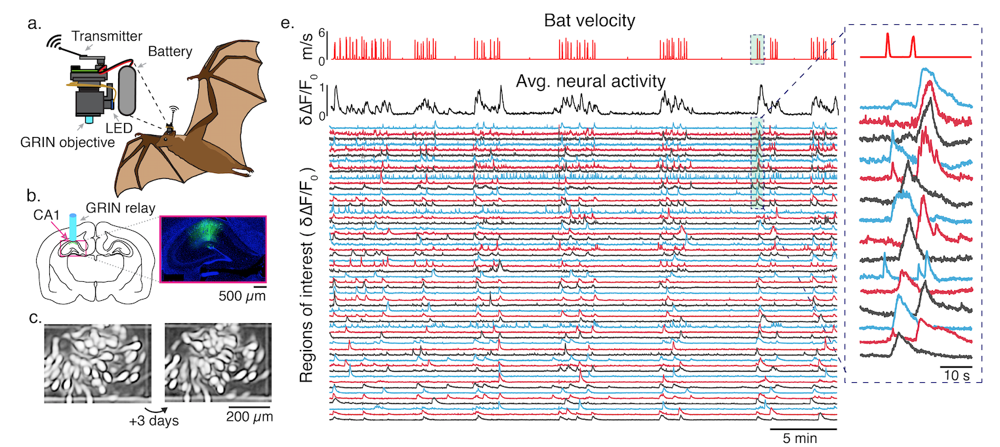
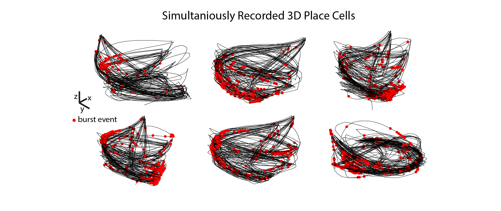

# ImBat: Calcium Imaging in Bats
Repository for code used for acquisition and analysis of data from wireless miniature microscopes in freely flying bats in the [Yartsev Lab](https://www.michaelyartsev.com) at UC Berkeley.

Below is a data sample of the raw (left) and background subtracted ( right) streamed imaging data.

    

Examples of 3D Place cells:

### Dependencies:
    CNMF-E: https://github.com/zhoupc/CNMF_E
    Noremcorre: https://github.com/flatironinstitute/NoRMCorre
    FinchScope (Liberti Branch) : https://github.com/gardner-lab/FinchScope/tree/Liberti

### Getting Started:
A detailed analysis walk-through can be found [here](https://github.com/WALIII/ImBat/wiki).

Learn more about wireless miniature microscopy and other neuro-photonics tools on [the FreedomScope page](https://github.com/WALIII/FreedomScope).
